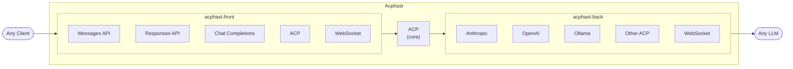
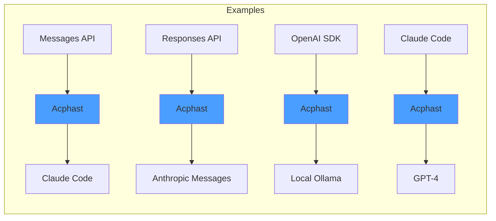
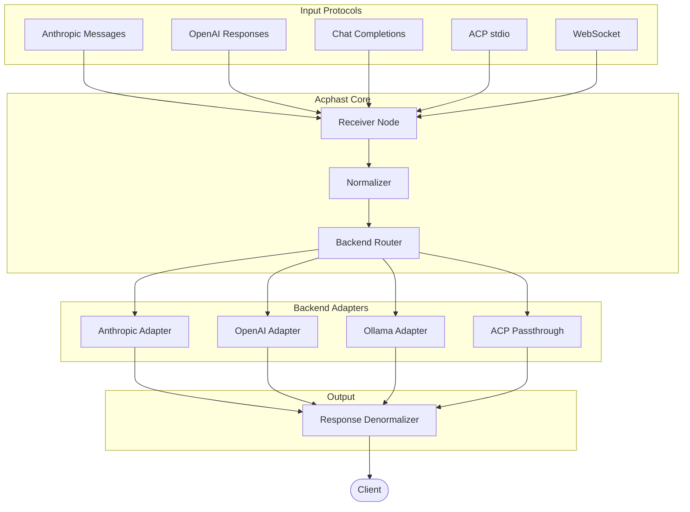

# Acphast

**Agent Client Protocol Heterogeneous Adapter Streaming Transceiver**

*Universal LLM Protocol Translator*

Acphast is a bidirectional proxy that translates between any LLM protocol—ACP, Anthropic Messages, OpenAI Responses, Chat Completions, and proprietary WebSocket APIs—without losing provider-specific capabilities.

## Features

- **Bidirectional translation** between any supported protocols
- **Zero capability loss** via `_meta` extensions
- **Streaming support** for real-time token output
- **Filter graph architecture** using Rete.js (TypeScript) or channels (Go)
- **Visual graph editing** (optional) for routing configuration
- **Multi-backend routing** based on capabilities or explicit selection

## Example Chains

## Architecture

## Documentation

| Document | Description |
|----------|-------------|
| [ACPHAST-PROXY-SPEC.md](docs/ACPHAST-PROXY-SPEC.md) | Protocol specification, `_meta` schemas |
| [ACPHAST-ARCHITECTURE.md](docs/ACPHAST-ARCHITECTURE.md) | Rete.js TypeScript implementation |
| [ACPHAST-BIDIRECTIONAL.md](docs/ACPHAST-BIDIRECTIONAL.md) | Front/back split architecture |
| [ACPHAST-GO.md](docs/ACPHAST-GO.md) | Go implementation with channels |
| [ACPHAST-README.md](docs/ACPHAST-README.md) | Quick start summary |
| [VISIONIK-AI-ROADMAP.md](docs/VISIONIK-AI-ROADMAP.md) | Full ecosystem roadmap |

## Status

**Draft** — Design phase. Not yet implemented.

## License

TBD
