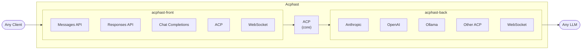
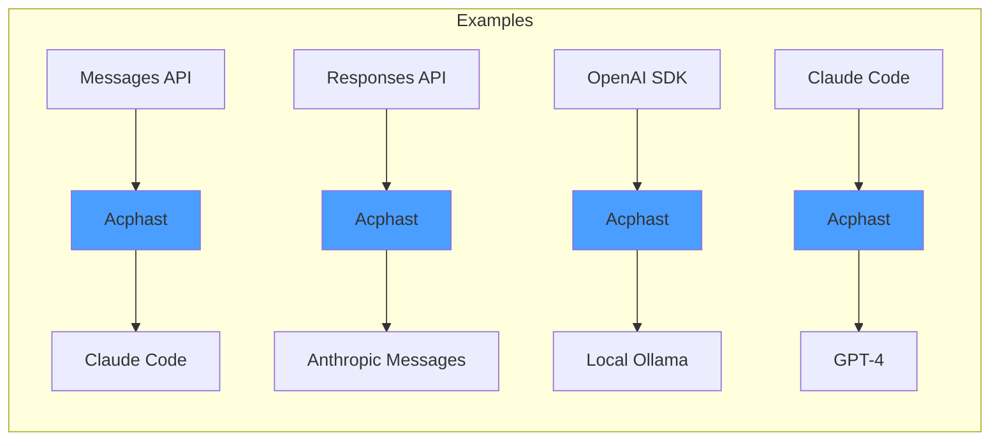
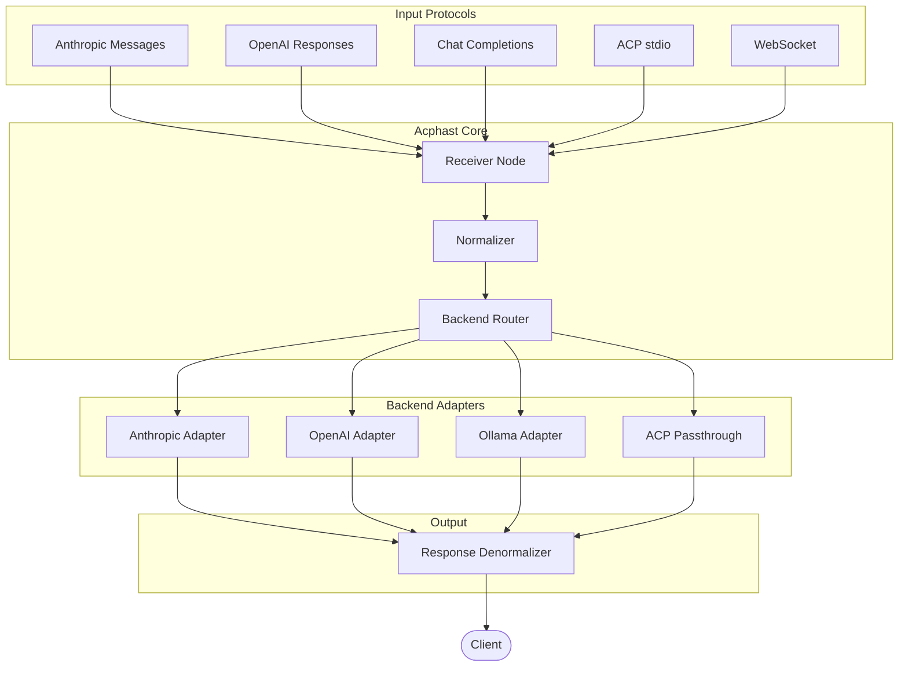

# Acphast

**Agent Client Protocol Heterogeneous Adapter Streaming Transceiver**

*Universal LLM Protocol Translator*

Acphast is a bidirectional proxy that translates between any LLM protocol—ACP, Anthropic Messages, OpenAI Responses, Chat Completions, and proprietary WebSocket APIs—without losing provider-specific capabilities.



## Features

- **Bidirectional translation** between any supported protocols
- **Zero capability loss** via `_meta` extensions
- **Streaming support** for real-time token output
- **Filter graph architecture** using Rete.js (TypeScript) or channels (Go)
- **Visual graph editing** (optional) for routing configuration
- **Multi-backend routing** based on capabilities or explicit selection

## Example Chains



## Architecture



## Documentation

| Document | Description |
|----------|-------------|
| [SPECIFICATION.md](SPECIFICATION.md) | Complete implementation specification |
| [RETE-NODE-ARCHITECTURE.md](docs/RETE-NODE-ARCHITECTURE.md) | Node-based design (core components as nodes) |
| [ACPHAST-PROXY-SPEC.md](docs/ACPHAST-PROXY-SPEC.md) | Protocol specification, `_meta` schemas |
| [ACPHAST-ARCHITECTURE.md](docs/ACPHAST-ARCHITECTURE.md) | Rete.js TypeScript implementation |
| [ACPHAST-BIDIRECTIONAL.md](docs/ACPHAST-BIDIRECTIONAL.md) | Front/back split architecture |
| [IMPLEMENTATION_PROGRESS.md](IMPLEMENTATION_PROGRESS.md) | Current development status |

## Quick Start

### Installation

```bash
# Install dependencies
pnpm install

# Build all packages
pnpm build
```

### Configuration

```bash
# Copy example config
cp acphast.example.toml acphast.toml

# Set API keys
export ANTHROPIC_API_KEY=sk-...
export OPENAI_API_KEY=sk-...
```

## Implementation Status

**In Active Development** — Phase 1: Foundation 66% complete

- ✅ Project setup and tooling
- ✅ Core types and schemas (@acphast/core)
- ✅ Configuration system (@acphast/config)
- 🚧 Graph engine (Rete.js + RxJS)
- 🚧 Node implementations
- 📋 CLI application
- 📋 Visual editor

See [IMPLEMENTATION_PROGRESS.md](IMPLEMENTATION_PROGRESS.md) and [SPECIFICATION.md](SPECIFICATION.md) for details.

## License

TBD
