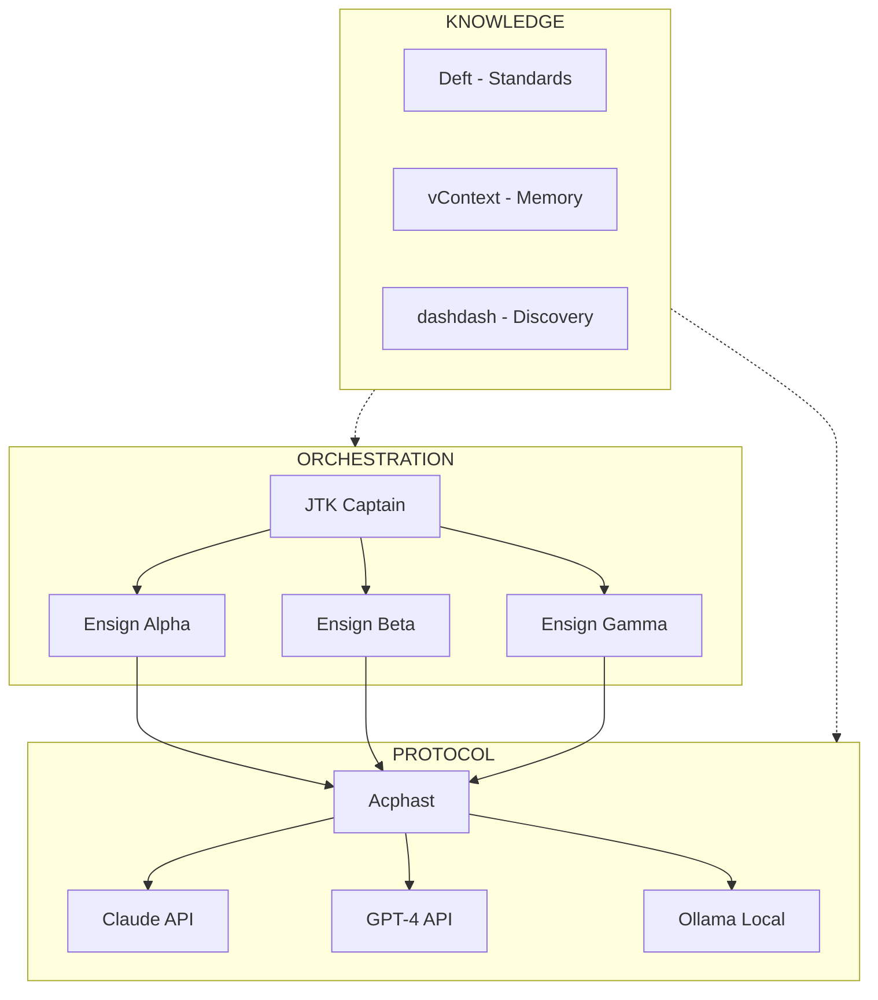
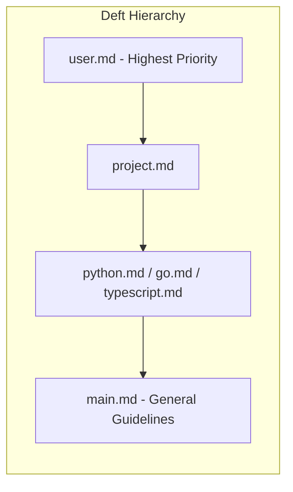
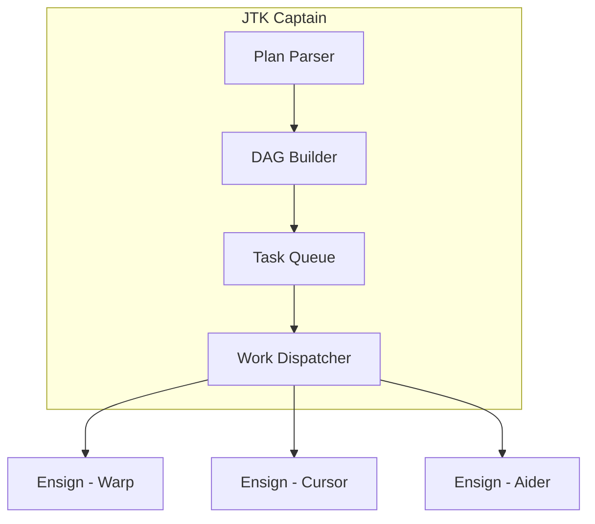
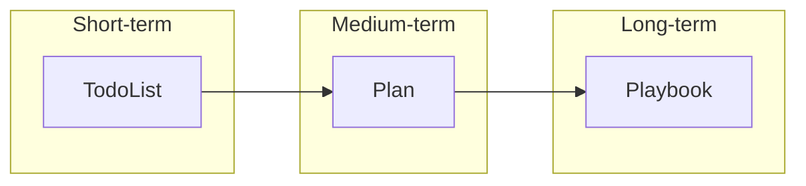
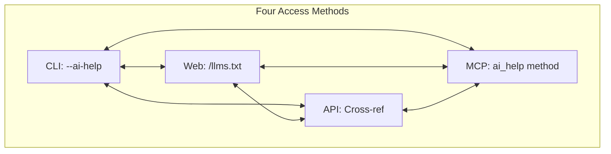
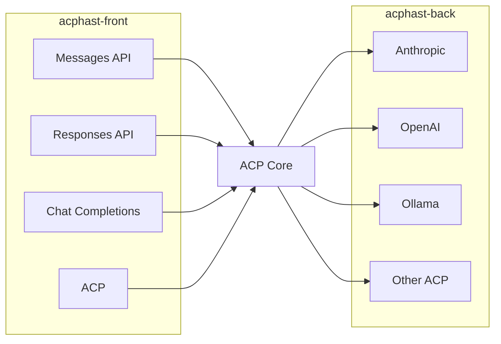
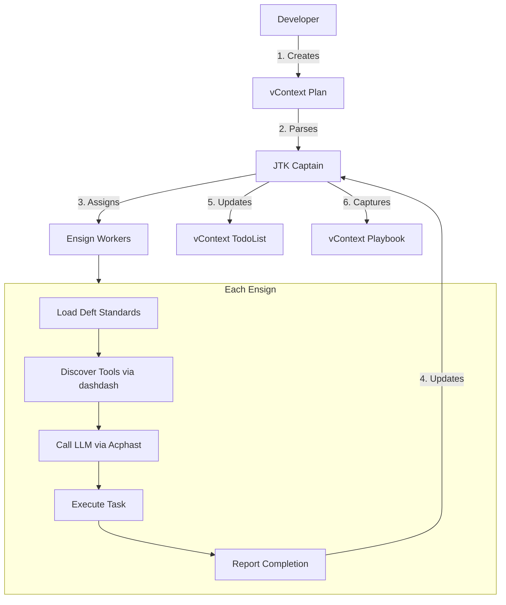
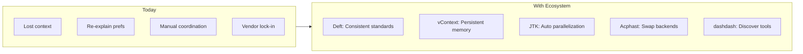
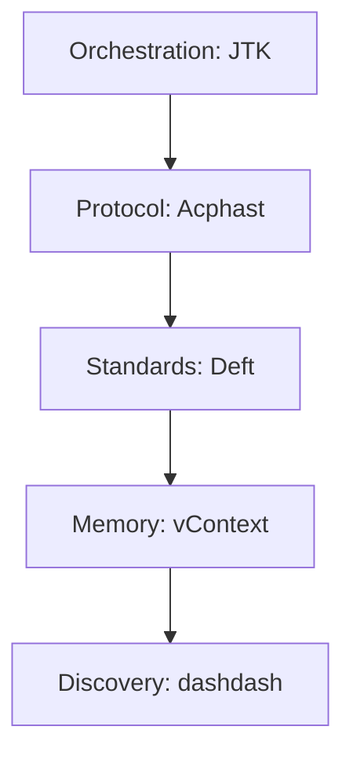

# Visionik AI Ecosystem Roadmap

**A Complete AI Coding System**

## Overview

Five projects that together form a complete AI-assisted software development ecosystem:



---

## The Five Projects

### 1. Deft — Standards & Preferences

**What:** Layered framework for AI-assisted development with consistent standards.

**Role in System:** The "brain" that tells agents HOW to code.



**Key Features:**
- Hierarchical rule precedence (user > project > language > general)
- RFC 2119 notation (!, ~, ≉, ⊗) for requirements
- Lazy loading — only load relevant files
- Self-improving — meta files capture learnings

**Integration Points:**
- JTK ensigns load Deft standards before executing tasks
- Acphast can inject Deft system prompts into LLM requests
- vContext plans can reference Deft workflows

---

### 2. JTK — Parallel Orchestration

**What:** Captain-ensign architecture for parallel coding agents.

**Role in System:** The "conductor" that coordinates multiple agents.



**Key Features:**
- vContext-native plan execution
- Git worktree isolation per worker
- Dependency-aware parallelism
- Checkpoint/resume for fault tolerance
- Agent-agnostic (Warp, Cursor, Aider, etc.)

**Integration Points:**
- Reads vContext plans for task definitions
- Applies Deft standards to each ensign
- Routes through Acphast for LLM backend flexibility
- Uses dashdash for tool discovery

---

### 3. vContext — Agent Memory

**What:** Open spec for todo lists, plans, and playbooks.

**Role in System:** The "memory" that structures agent work.



**Key Features:**
- TRON encoding (token-efficient for LLMs)
- JSON compatibility for tooling
- Hierarchical items with dependencies
- Status tracking across sessions
- Cross-document linking

**Integration Points:**
- JTK parses vContext plans for orchestration
- Deft workflows can output vContext todos
- Playbooks accumulate learnings from JTK missions
- Acphast can include vContext in LLM context

---

### 4. dashdash — Tool Discovery

**What:** Spec for AI agents to discover and use tools.

**Role in System:** The "interface" that teaches agents about tools.



**Key Features:**
- Unified discovery across CLI, Web, API, MCP
- "When to Use" sections for skill triggering
- Cross-references between access methods
- Go/Cobra integration for auto-generation

**Integration Points:**
- Deft skills can reference dashdash for tool usage
- JTK ensigns discover tools via dashdash
- Acphast can route to MCP servers discovered via dashdash
- vContext playbooks can store tool learnings

---

### 5. Acphast — Protocol Translation

**What:** Universal proxy between any LLM protocols.

**Role in System:** The "translator" that decouples agents from backends.



**Key Features:**
- Bidirectional protocol translation
- Zero capability loss via `_meta` extensions
- Filter graph architecture (Rete.js / Go channels)
- Visual graph editing for routing
- Multi-backend routing and load balancing

**Integration Points:**
- JTK routes all LLM calls through Acphast
- Can inject Deft system prompts
- Supports MCP tools discovered via dashdash
- Can include vContext in requests

---

## How They Fit Together

### Data Flow



### Integration Matrix

| Component | Uses Deft | Uses JTK | Uses vContext | Uses dashdash | Uses Acphast |
|-----------|-----------|----------|---------------|---------------|-------------|
| **Deft** | — | Standards for ensigns | Workflow → todos | Tool usage docs | System prompts |
| **JTK** | Ensign standards | — | Plan execution | Tool discovery | LLM routing |
| **vContext** | Workflow refs | Plan format | — | — | Context inclusion |
| **dashdash** | Skill definitions | Tool for ensigns | — | — | MCP routing |
| **Acphast** | Prompt injection | Backend for JTK | Context in requests | MCP discovery | — |

---

## Roadmap

### Phase 1: Foundation (Current)

| Project | Status | Next Steps |
|---------|--------|------------|
| **Deft** | ✅ v1.0 | Expand language support, add more workflows |
| **JTK** | 🚧 v0.2 | Stabilize mission orchestration, production testing |
| **vContext** | 📝 v0.4 | Finalize spec, build reference parsers |
| **dashdash** | 📝 v0.2 | Implement Go/Cobra integration, test with real tools |
| **Acphast** | 📝 Design | Implement core engine, build adapters |

### Phase 2: Integration


### Phase 3: Ecosystem (2027+)

- Public Deft standard library
- vContext tool ecosystem
- dashdash adoption by tool authors
- Acphast as industry standard
- JTK cloud service

---

## The Vision

**Today:** Developers use individual AI tools (Cursor, Copilot, Claude) in isolation, losing context between sessions, re-explaining preferences, manually coordinating parallel work.

**With this ecosystem:**



**The result:** An AI-augmented development environment where:
- Standards are applied consistently
- Memory persists and evolves
- Tools are discoverable and interchangeable
- Backends are swappable
- Work is parallelized automatically

---

## Repository Links

| Project | Repo | Description |
|---------|------|-------------|
| Deft | [visionik/deft](https://github.com/visionik/deft) | Standards & guidelines |
| JTK | [visionik/jtk](https://github.com/visionik/jtk) | Parallel orchestration |
| vContext | [visionik/vcontext](https://github.com/visionik/vcontext) | Memory specification |
| dashdash | [visionik/dashdash](https://github.com/visionik/dashdash) | Tool discovery |
| Acphast | [visionik/acphast](https://github.com/visionik/acphast) | Protocol translation |

---

## Quick Start (Future)

```bash
# Install the ecosystem
brew install visionik/tap/ai-coding-system

# Initialize a project with Deft standards
deft init

# Create a vContext plan
vcontext plan create "Build feature X"

# Start JTK captain with the plan
jtk captain start ./plans/feature-x.vcontext

# Connect ensigns (in separate terminals)
jtk ensign connect --agent warp
jtk ensign connect --agent cursor

# Watch parallel execution
jtk mission watch
```

---

## Summary



Together: **A complete, open, interoperable AI coding system.**
