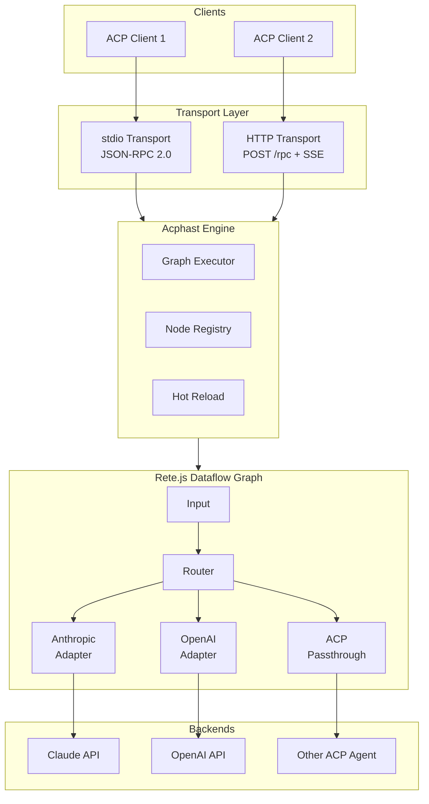
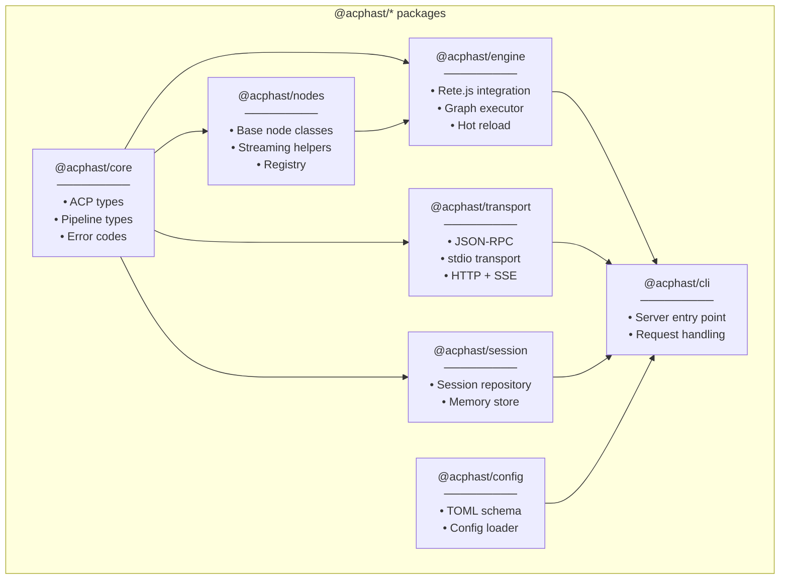
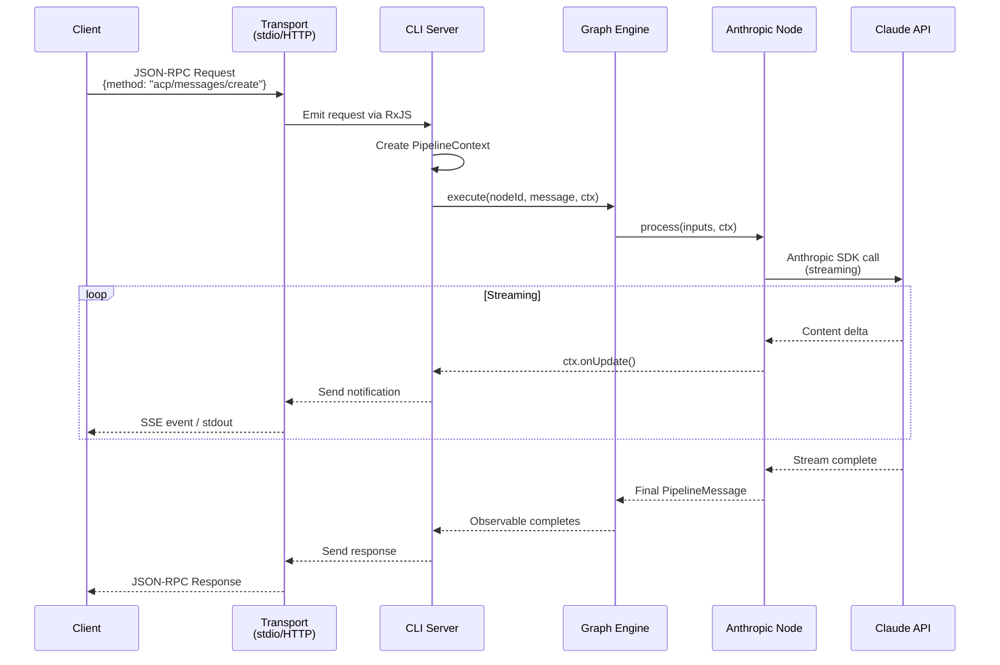
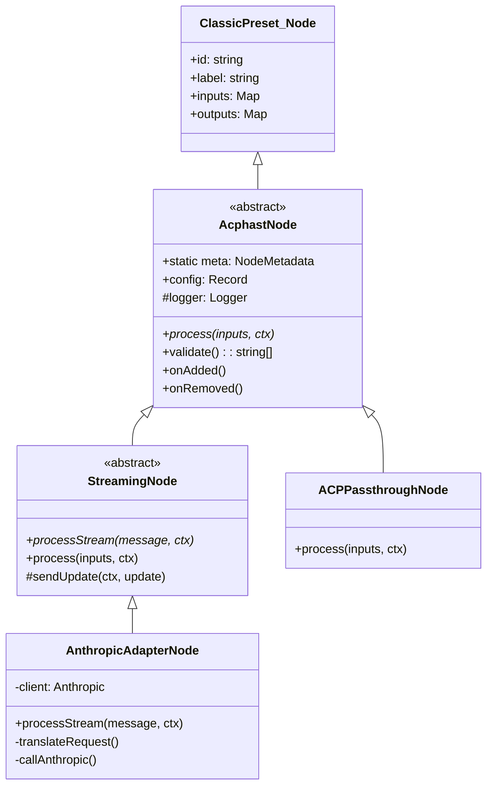
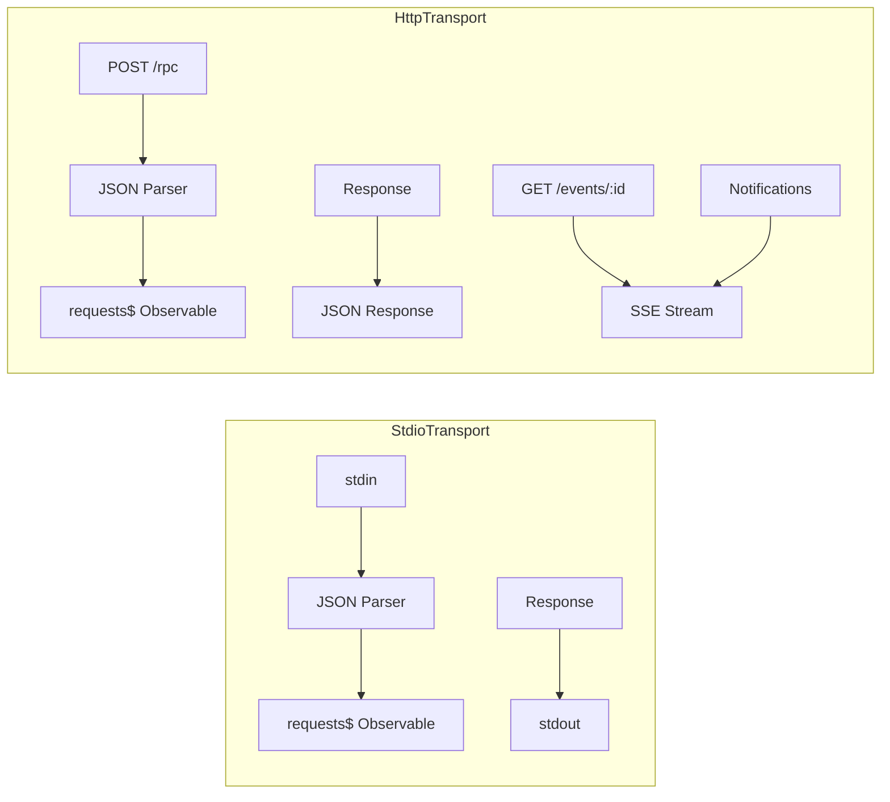
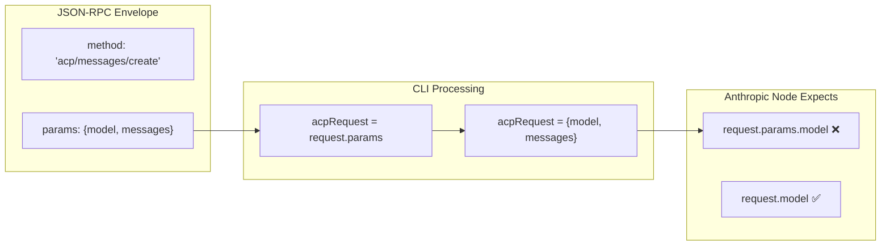

# Acphast Current State

**Date:** 2026-02-04  
**Version:** MVP (~50% complete)

## What is Acphast?

Acphast (**A**gent **C**lient **P**rotocol **H**eterogeneous **A**dapter **S**treaming **T**ransceiver) is a universal LLM protocol translator. It routes ACP (Agent Client Protocol) requests to various backends (Anthropic, OpenAI, Ollama) without losing provider-specific features.

## High-Level Architecture



## Package Structure



## Request Flow



## Node Architecture

All nodes extend the Rete.js `ClassicPreset.Node` and implement a `process()` method that works with RxJS observables:



## Transport Layer

Two transport implementations handle client communication:



## What's Working Now

| Component | Status | Notes |
|-----------|--------|-------|
| Core types | ✅ Complete | ACP protocol, pipeline types, errors |
| Node base classes | ✅ Complete | AcphastNode, StreamingNode |
| Node registry | ✅ Complete | Dynamic node registration |
| Graph engine | ✅ Complete | Rete.js integration, execution |
| Hot reload | ✅ Complete | fs.watch based |
| stdio transport | ✅ Complete | JSON-RPC 2.0 |
| HTTP transport | ✅ Complete | POST + SSE |
| Session management | ✅ Complete | In-memory store |
| ACP Passthrough | ✅ Complete | Simple passthrough node |
| Anthropic adapter | ⚠️ Bug | Request structure mismatch |

## Current Bug

The Anthropic adapter has a request structure mismatch:



**Fix needed:** The CLI should construct the ACPRequest with both `method` and `params`:

```typescript
const acpRequest = {
  method: request.method,
  params: request.params,
} as ACPRequest;
```

## Graph Definition Format

Graphs are defined as JSON and can be hot-reloaded:

```json
{
  "version": "1.0.0",
  "metadata": {
    "name": "Claude Adapter",
    "description": "Direct connection to Anthropic Claude models"
  },
  "nodes": [
    {
      "id": "claude",
      "type": "Anthropic Adapter",
      "config": {
        "defaultModel": "claude-sonnet-4-20250514",
        "maxTokens": 4096
      }
    }
  ],
  "connections": []
}
```

## Next Steps

1. **Fix the request structure bug** in CLI → Anthropic adapter flow
2. **Add OpenAI adapter** node
3. **Implement router nodes** for backend selection
4. **Build visual editor** with full Rete.js integration
5. **Add comprehensive tests**

## Running the Demo

```bash
# Start HTTP server with Claude
TRANSPORT=http ANTHROPIC_API_KEY=sk-ant-... pnpm --filter @acphast/cli start

# Open chat interface
open web/chat.html
```
